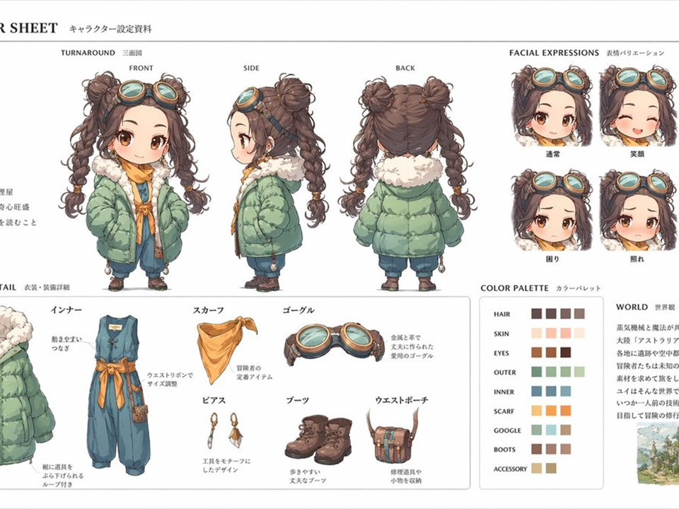
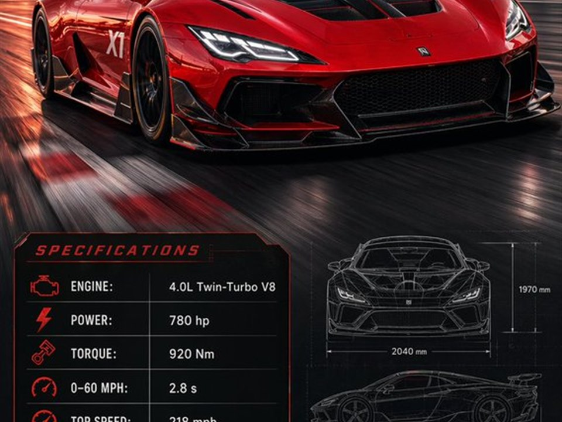
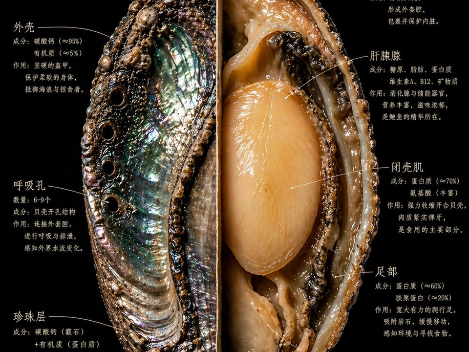

<p align="center">
  
</p>

<h1 align="center">YUFENG Canvas</h1>

<p align="center">
  A local AI visual workflow studio for chat, text-to-image, image-to-image, text-to-video, image-to-video, and reusable node pipelines.
</p>

<p align="center">
  <a href="README.md">简体中文</a>
  ·
  <a href="https://github.com/cyf1124906008-ai/yufeng-canvas/releases/latest/download/YUFENG-Canvas-Latest.exe">Download for Windows</a>
  ·
  <a href="https://github.com/cyf1124906008-ai/yufeng-canvas/releases/latest">Latest Release</a>
  ·
  <a href="https://dataeyes.ai/?promoter_code=nqg9bv83">Get a DataEyes API Key</a>
</p>


## What Is It?

YUFENG Canvas is a desktop canvas for AI visual production. Instead of sending one-off prompts, you can configure your own API keys and model names, then compose reusable workflows with text, image, video, and configuration nodes.

It is designed for:

- Designers creating posters, product images, character sheets, brand visuals, and social media assets.
- Video creators turning prompts and reference frames into short video workflows.
- AIGC users testing different models, ratios, references, and node connections.
- Teams who want reusable local workflows instead of scattered prompt notes.

## Highlights

| Feature | Description |
| --- | --- |
| Chat | Use your configured text model to brainstorm, structure ideas, and polish prompts. |
| Image generation | Text-to-image, image-to-image, reference images, ordered references, and ratio/size selection. |
| Video generation | Text-to-video, first/last frame references, ratio, duration, polling, and downloads. |
| Node workflows | Connect text, image, video, and config nodes into reusable visual pipelines. |
| Public workflows | Built-in templates for storyboards, ecommerce sets, character kits, scenes, branding, short videos, and picture books. |
| Inspiration library | GPT Image 2 prompt case cards that can be sent directly into the canvas. |
| Custom models | Configure separate API keys, base URLs, providers, and model names for chat, image, and video. |
| Run logs | Inspect request URLs, task IDs, status, errors, and raw provider responses. |
| Auto update | v0.1.17 and newer can check GitHub releases from inside the app. |

## Product Preview

### Home and Fast Creation


### Node-Based Visual Workflow


### Bring Your Own API and Models


### Inspiration Cases

| Character Sheet | Product Kit | Racing Spec | Natural History |
| --- | --- | --- | --- |
|  |  |  |  |

## Quick Start

1. Download and install [YUFENG-Canvas-Latest.exe](https://github.com/cyf1124906008-ai/yufeng-canvas/releases/latest/download/YUFENG-Canvas-Latest.exe).
2. Open `API Settings` in the top-right corner.
3. Fill in your own API key, base URL, provider, and model names.
4. Start from chat on the home page, or create a project and use the workflow canvas.

Default DataEyes endpoint:

```text
https://cloud.dataeyes.ai
```

Get an API key:

[https://dataeyes.ai/?promoter_code=nqg9bv83](https://dataeyes.ai/?promoter_code=nqg9bv83)

## Model Configuration

YUFENG Canvas does not ship with your API key and does not bundle any private credentials into the installer. Every user should configure their own:

- `Provider`: for example `dataeyes`, or any custom provider label.
- `Base URL`: for example `https://cloud.dataeyes.ai`.
- `API Key`: the user's own key.
- `Model names`: manually add chat, image, and video models according to the provider dashboard.

Example model names:

| Type | Examples |
| --- | --- |
| Chat | `gpt-4o-mini`, `deepseek-chat`, `gemini-3-pro` |
| Image | `gpt-image-2-sp`, `gpt-image-2` |
| Video | `kling-v2-5-turbo`, `doubao-seedance-2.0` |

## Development

```bash
git clone https://github.com/cyf1124906008-ai/yufeng-canvas.git
cd yufeng-canvas
pnpm install
pnpm dev
```

## Build Desktop App

```bash
pnpm desktop:dist
```

Installer files are generated in `release/`.

## Credits

Some prompt ideas and case images are adapted from [EvoLinkAI/awesome-gpt-image-2-prompts](https://github.com/EvoLinkAI/awesome-gpt-image-2-prompts), licensed under Apache-2.0.

## License

MIT
