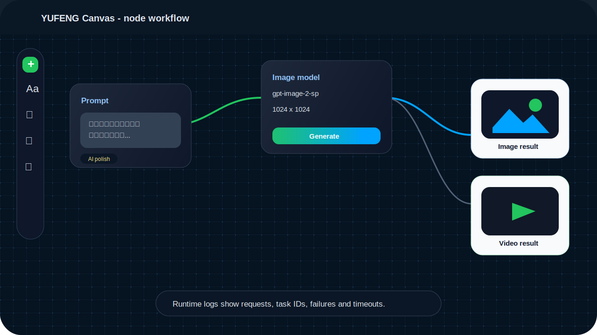
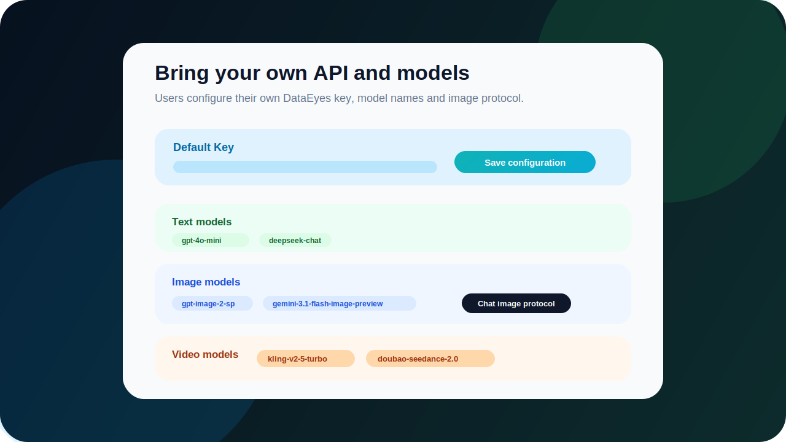

# YUFENG Canvas

YUFENG Canvas 是一个本地运行的 AI 视觉工作台，把 **直接对话、文生图、图生图、文生视频、图生视频、节点工作流** 放在同一个桌面应用里。用户只需要填写自己的 DataEyes API Key 和模型名，就能开始创作，不需要自己搭环境。


## 下载

Windows 用户可以直接下载最新版安装包：

[下载 YUFENG Canvas](https://github.com/cyf1124906008-ai/yufeng-canvas/releases/latest)

也可以在软件右上角点击“检查更新”。新版安装包支持覆盖安装，不需要先卸载旧版本。

## 适合做什么

- 和文本模型直接聊天，整理创意、拆分分镜、优化提示词。
- 把一个想法拆成节点流程，复用同一套文生图、图生图和视频生成链路。
- 给图片生成首帧、尾帧、参考图，再连接到视频节点。
- 给不同能力配置不同 API Key，例如文本、图片、视频各用一把 Key。
- 让最终用户自己填写模型名，避免模型名变化后必须重新打包。

## 产品预览

### 节点式视觉工作流



### 自定义模型和调用协议



## 核心能力

| 能力 | 说明 |
| --- | --- |
| 直接对话 | 首页可以直接调用用户配置的文本模型聊天。 |
| 文生图 | 支持多提示词输入、尺寸/比例选择、运行日志。 |
| 图生图 | 支持参考图输入，适合重绘、风格化和商业海报。 |
| 文生视频 | 支持提示词、比例、时长和视频任务轮询。 |
| 图生视频 | 支持首帧、尾帧、参考图和视频模型配置。 |
| 模型协议 | 图片模型支持自动识别、图片接口、Chat 图片接口。Gemini image-preview 类模型会自动走 Chat 图片通道。 |
| 运行日志 | 记录请求、任务 ID、成功、失败和超时，方便定位问题。 |
| 应用更新 | 检查 GitHub Release，发现新版后打开安装包下载页。 |

## 用户配置

首次打开软件后，进入右上角 `API 设置`：

1. 填写自己的 DataEyes API Key。
2. 在 `模型配置` 中添加文本模型、图片模型、视频模型。
3. 图片模型如果不是标准 `/images/generations` 协议，可以把协议切到 `Chat 图片接口`。
4. 保存后即可使用首页对话或创建画布项目。

默认服务地址：

```text
https://cloud.dataeyes.ai
```

申请 API Key：

[https://dataeyes.ai/?promoter_code=nqg9bv83](https://dataeyes.ai/?promoter_code=nqg9bv83)

## 推荐模型配置示例

下面只是示例，实际以 DataEyes 后台展示的模型名为准。

| 类型 | 示例模型 |
| --- | --- |
| 文本模型 | `gpt-4o-mini`、`deepseek-chat`、`gemini-3-pro` |
| 图片模型 | `gpt-image-2-sp`、`gpt-image-2`、`gemini-3.1-flash-image-preview-sp` |
| 视频模型 | `kling-v2-5-turbo`、`doubao-seedance-2.0` |

## 本地开发

```bash
git clone https://github.com/cyf1124906008-ai/yufeng-canvas.git
cd yufeng-canvas
pnpm install
pnpm dev
```

## 桌面打包

```bash
pnpm desktop:dist
```

打包产物会生成到 `release/` 目录。Windows 安装包文件名类似：

```text
YUFENG Canvas Setup 0.1.10.exe
```

## 发布新版本

1. 修改 `package.json` 里的 `version`。
2. 执行 `pnpm desktop:dist`。
3. 提交源码并推送到 GitHub。
4. 创建 GitHub Release，例如 `v0.1.10`。
5. 上传安装包、`.blockmap` 和 `latest.yml`。

用户端“检查更新”会读取 GitHub 最新 Release。当前实现会打开下载页/安装包链接，由用户覆盖安装；如果要静默自动下载和自动安装，可以后续接入 `electron-updater`。

## 技术栈

- Vue 3
- Vite
- Electron
- Vue Flow
- Naive UI
- Tailwind CSS
- Pinia

## License

MIT
