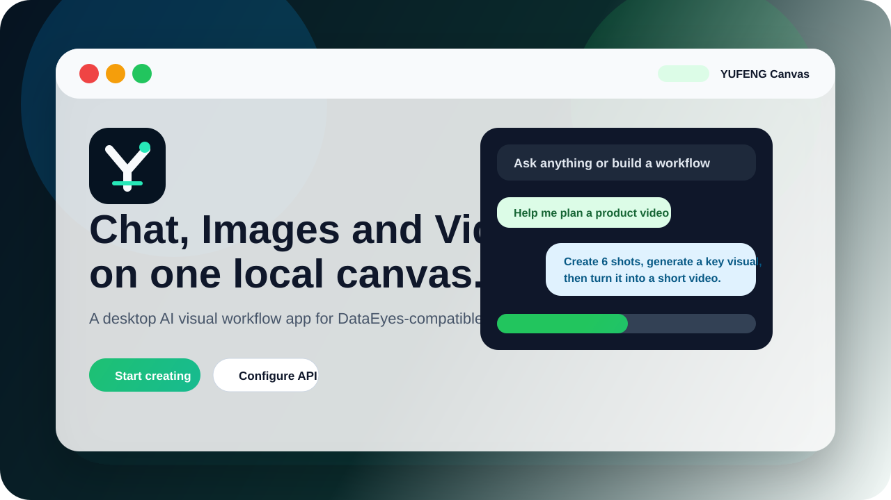
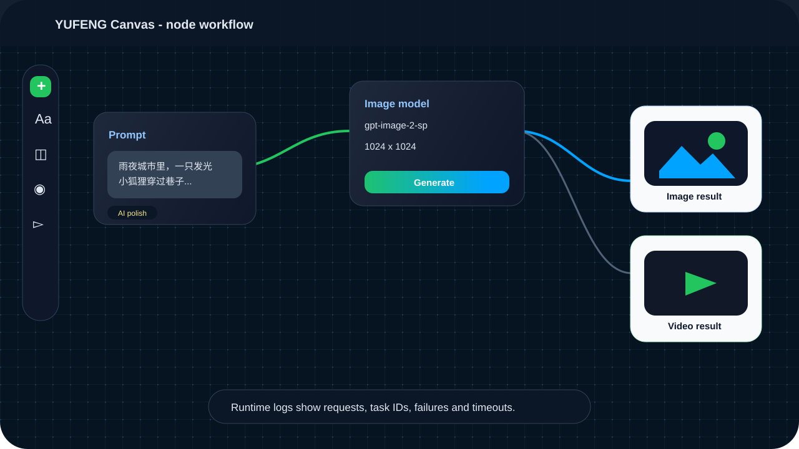
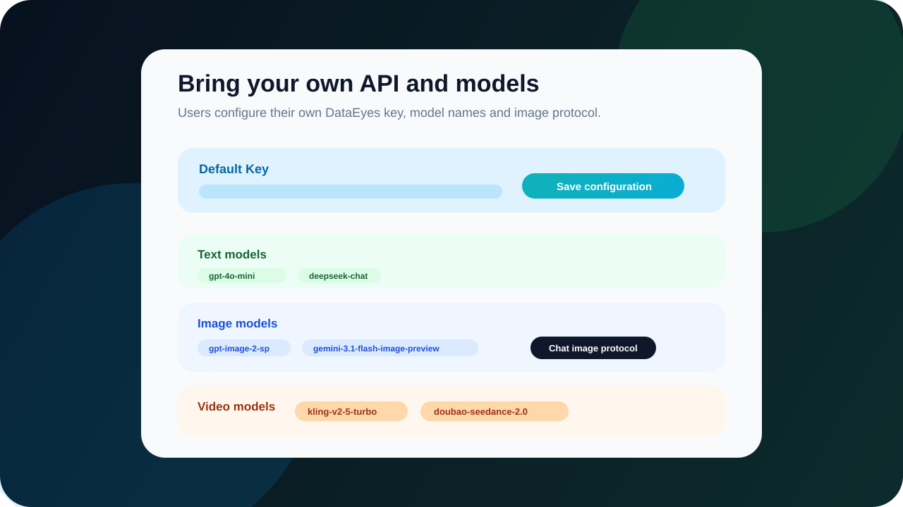
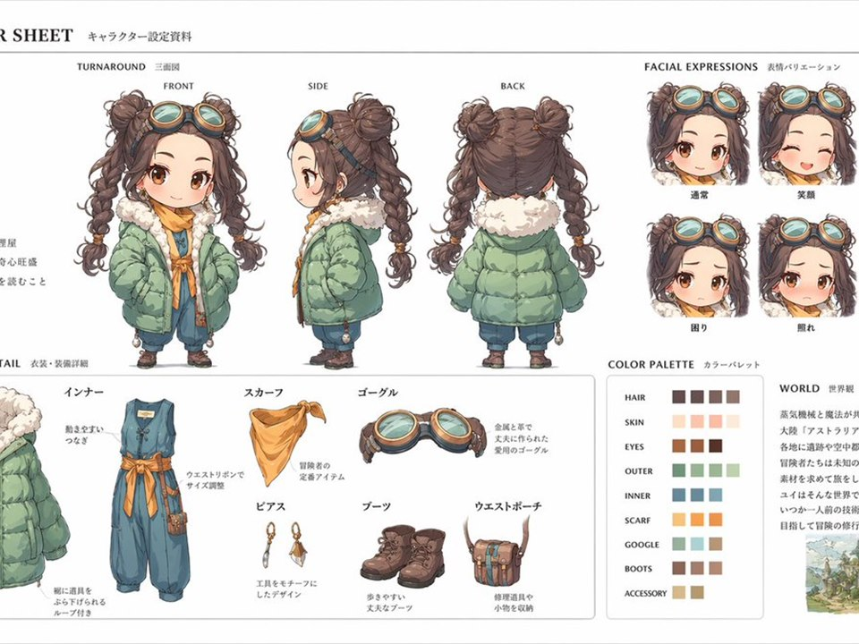
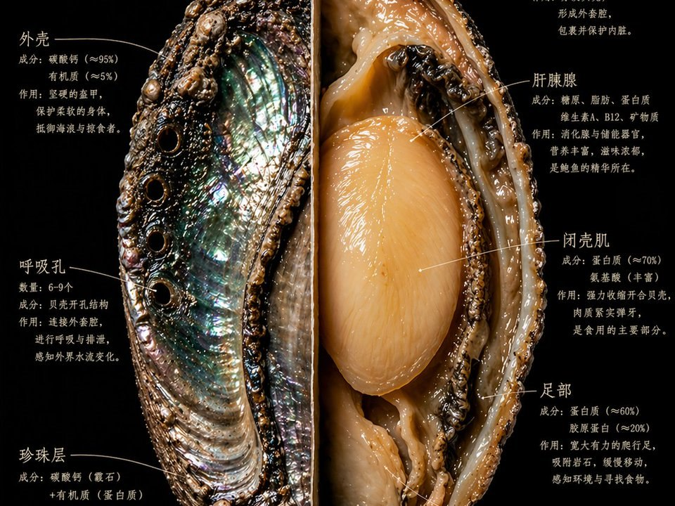

<p align="center">
  
</p>

<h1 align="center">YUFENG Canvas</h1>

<p align="center">
  本地运行的 AI 视觉创作画布，把对话、文生图、图生图、文生视频、图生视频和节点工作流放进一个桌面应用。
</p>

<p align="center">
  <a href="README.en.md">English</a>
  ·
  <a href="https://github.com/cyf1124906008-ai/yufeng-canvas/releases/latest/download/YUFENG-Canvas-Latest.exe">下载最新版 Windows 安装包</a>
  ·
  <a href="https://github.com/cyf1124906008-ai/yufeng-canvas/releases/latest">Latest Release</a>
  ·
  <a href="https://dataeyes.ai/?promoter_code=nqg9bv83">申请 DataEyes API Key</a>
</p>

<p align="center">
  
  
  
  
  
</p>



## 为什么做这个

很多 AI 生图/视频工具只能单次输入提示词，真正做项目时却需要不断拆想法、试比例、换模型、接参考图、生成视频、保存结果。YUFENG Canvas 更像一个本地创作工作台：用户自己配置 API Key 和模型名，然后把每一步变成可复用的节点流程。

它适合：

- 设计师：快速生成产品主图、海报、角色设定、社媒图和品牌视觉。
- 短视频创作者：把提示词、首尾帧、参考图和视频生成串成可复用流程。
- AIGC 工作流玩家：在同一个画布里测试不同模型、比例、参考图和节点连接。
- 团队或客户交付：把稳定流程保存成项目，下次直接复用。

## 功能亮点

| 能力 | 说明 |
| --- | --- |
| 直接对话 | 首页可以直接调用用户配置的文本模型，用来整理创意、拆分镜、润色提示词。 |
| Creative Agent Autopilot | 用户只描述最终作品，Agent 逐步决定下一动作、按能力选择模型、创建 Canvas 节点并等待真实图片或视频结果。 |
| Result Observation | 图片生成后自动做技术检查与视觉评分；未达标时改进提示词并有限次重做，Canvas 保留每次候选和 Quality Check 节点。 |
| Model Intelligence Router | 按能力、质量、速度、成本、可靠性与可用性给模型排序；遇到 429、5xx、超时等临时故障时自动切换候选。 |
| 文生图 / 图生图 | 支持提示词、参考图、图片顺序、比例/尺寸选择和结果节点复用。 |
| 文生视频 / 图生视频 | 支持文本生成视频、首帧/尾帧参考图、比例、时长、任务轮询和视频下载。 |
| 节点工作流 | 文本、图片、视频、配置节点可以自由连接，适合搭建可重复执行的流程。 |
| 公共工作流 | 内置分镜、电商套图、短剧角色、场景变体、品牌视觉、短视频和绘本案例。 |
| 灵感案例库 | 集成 GPT Image 2 提示词案例卡片，点击即可带入画布继续二创。 |
| 多 Key / 多模型 | 文本、图片、视频可以分别配置 API Key、Base URL、Provider 和模型名。 |
| 运行日志 | 记录请求地址、任务 ID、状态、错误和原始响应，方便排查供应商问题。 |
| 客户端更新 | v1.0.0 起更新前会提示先备份本地项目和素材，避免覆盖安装前数据丢失。 |

## v1.0.0 正式版重点

- **云端模型优先**：通过 API Key + Base URL 接入 OpenAI 兼容、DataEyes、火山/豆包等供应商，不要求普通用户部署本地模型。
- **ComfyUI 风格专业参数**：把 Prompt、Negative Prompt、Seed、Steps、CFG、Sampler、Scheduler、LoRA、ControlNet、参考图、重绘、放大等概念包装成中文配置。
- **复杂工作流库**：新增角色一致性、短剧分镜、电商广告、局部重绘、图生视频、九宫格拆图等更贴近生产的工作流。
- **Drama 工作区**：短剧项目、角色、场景、分镜、首帧和视频任务进入同一个 Canvas 项目结构。
- **稳定生成任务**：图片/视频/Comfy 任务结果尽量保存为本地资产；图片生成前端等待超时后，主进程继续等待供应商结果。
- **更新前备份**：检查到新版和安装新版前都会提示备份，本地项目数据和生成素材不静默覆盖。

## 产品预览

### 1. 首页：对话和快速创作


### 2. 画布：节点式视觉工作流



### 3. 模型设置：用户自带 API Key 和模型名



### 4. 灵感案例：点击案例直接生成工作流

| 角色设定 | 产品套装 | 赛车规格 | 自然图鉴 |
| --- | --- | --- | --- |
|  |  |  |  |

| 国潮长卷 | 绘本场景 | 城市美食地图 | 未来城市海报 |
| --- | --- | --- | --- |
|  |  |  |  |

## 快速开始

### 普通用户

1. 下载并安装：[YUFENG-Canvas-Latest.exe](https://github.com/cyf1124906008-ai/yufeng-canvas/releases/latest/download/YUFENG-Canvas-Latest.exe)。
2. 打开右上角 `API 设置`。
3. 填写自己的 API Key、Base URL、Provider 和模型名。
4. 在首页直接对话，或点击 `开始创作` 进入节点画布。

如果浏览器拦截直接下载，可以打开 [Latest Release](https://github.com/cyf1124906008-ai/yufeng-canvas/releases/latest) 手动下载。覆盖安装即可，不需要先卸载。

> 升级提示：从旧版本升级到 v1.0.0 前，建议先在设置页导出本地数据，并单独备份本地素材目录。新版客户端也会在自动更新前弹出备份确认。

### 推荐默认服务

```text
Base URL: https://cloud.dataeyes.ai
申请地址: https://dataeyes.ai/?promoter_code=nqg9bv83
```

模型名以供应商后台显示为准。不同供应商对图片、视频、参考图、首尾帧的参数支持不完全一致，遇到错误时先看右侧运行日志。

## 配置说明

### API 设置

YUFENG Canvas 不内置你的 Key，也不会把 Key 打包进安装包。每个用户首次使用都需要自己填写：

- `Provider`：例如 `dataeyes`，也可以填自定义供应商名称。
- `Base URL`：例如 `https://cloud.dataeyes.ai`。
- `API Key`：用户自己的 Key。
- `模型名`：文本、图片、视频模型都支持用户手动添加，不强制默认模型。

### 模型示例

这些只是示例，不代表一定对所有账号可用。请以供应商后台为准。

| 类型 | 示例 |
| --- | --- |
| 文本模型 | `gpt-4o-mini`、`deepseek-chat`、`gemini-3-pro` |
| 图片模型 | `gpt-image-2-sp`、`gpt-image-2` |
| 视频模型 | `kling-v2-5-turbo`、`doubao-seedance-2.0` |

## 常见问题

### 为什么别的电脑填了 Key 还是不通？

优先检查 `Base URL`、`Provider`、模型名是否和供应商后台完全一致。很多报错不是本地环境问题，而是模型不支持当前能力，例如把只支持对话的模型用于图片生成，供应商可能返回 `not supported model for image generation`。

### 为什么后台扣费了但页面没看到视频？

视频模型通常是异步任务。YUFENG Canvas 会轮询任务结果，并在运行日志里显示任务 ID、请求地址、返回状态和最终视频地址。如果供应商任务完成但没有返回视频 URL，页面会明确提示并保留任务 ID，便于你去供应商侧排查。

### AI 润色为什么会改变语言？

当前提示词润色模板要求保持用户原始语言：中文输入返回中文，英文输入返回英文。如果仍出现翻译，通常是具体文本模型行为导致，可以换文本模型或在输入里明确写“不要翻译成英文”。

### 更新必须重新下载安装包吗？

从 `v1.0.0` 开始，客户端检查到新版后不会静默下载或安装，会先提示用户备份本地项目数据和生成素材。已经安装旧版的用户，可以手动下载 v1.0.0 覆盖安装一次，后续再使用右上角更新入口。

## 本地开发

```bash
git clone https://github.com/cyf1124906008-ai/yufeng-canvas.git
cd yufeng-canvas
pnpm install
pnpm dev
```

运行 Agent 内核与模型路由测试：

```bash
pnpm test
```

## 桌面打包

```bash
pnpm desktop:dist
```

打包产物会生成到 `release/` 目录。

## 发布新版本

1. 修改 `package.json` 里的 `version`。
2. 执行 `pnpm desktop:dist`。
3. 提交源码并推送到 GitHub。
4. 创建 GitHub Release，上传安装包、`.blockmap`、`latest.yml`。
5. 同时上传稳定文件名 `YUFENG-Canvas-Latest.exe`，README 的直接下载入口会始终指向最新版。
6. Release 正文可以直接使用 [docs/releases/v1.0.0.md](docs/releases/v1.0.0.md) 作为模板。

## 技术栈

- Vue 3
- Vite
- Electron
- Electron Updater
- Vue Flow
- Naive UI
- Tailwind CSS
- Pinia

## Roadmap

- ✅ V0.1 Autopilot：一句话自动创建并运行图片 / 视频工作流。
- ✅ V0.2 Result Observation：视觉评价、本地评分、有限重做和 Canvas 质检节点。
- ✅ V0.3 Model Intelligence Router：模型画像、约束过滤、策略评分和失败 fallback。
- 更完整的公共工作流市场。
- 更多供应商参数预设和能力检测。
- 工作流导入/导出和团队共享。
- 更细的图片/视频任务队列与失败重试。
- macOS 安装包。

## Credits

部分提示词灵感和案例图片改编/选自 [EvoLinkAI/awesome-gpt-image-2-prompts](https://github.com/EvoLinkAI/awesome-gpt-image-2-prompts)，原项目仓库包含 Apache-2.0 License 与 README 中的 CC BY 4.0 标识说明。部分提示词模式参考 [Anil-matcha/Awesome-GPT-Image-2-API-Prompts](https://github.com/Anil-matcha/Awesome-GPT-Image-2-API-Prompts)，原项目采用 MIT License。YUFENG Canvas 内置文案已整理成适合节点画布的一键创作模板。

## Local API / MCP

Desktop builds start a localhost-only helper endpoint for integrations:

```text
http://127.0.0.1:43112
```

See [docs/local-api-mcp.md](docs/local-api-mcp.md) for health checks, MCP JSON-RPC examples, and configuration notes.

## License

MIT
