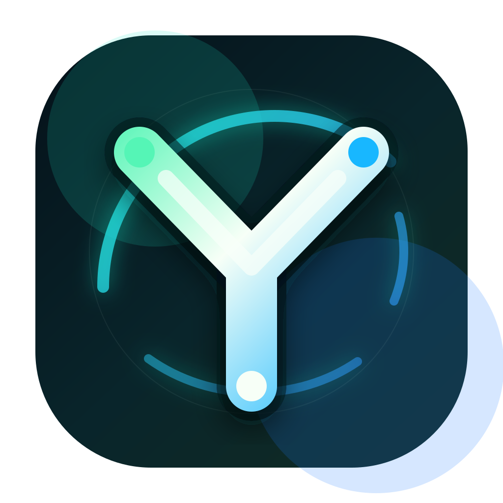

<p align="center">
  
</p>

<h1 align="center">YUFENG Agent</h1>

<p align="center">
  Autonomous Creative Agent Harness：用户只说最终要什么，Agent 自主选择模型、执行、观察并交付作品。
</p>

<p align="center">
  <a href="https://github.com/cyf1124906008-ai/yufeng-canvas/releases/latest">Latest Release</a>
  ·
  <a href="https://dataeyes.ai/?promoter_code=nqg9bv83">申请 DataEyes API Key</a>
</p>

<p align="center">
  
  
  
  
</p>

## 产品方向

YUFENG Agent 不要求用户拖节点或手工连接工作流。默认入口是一句话任务：

```text
用户目标
  ↓
Creative Agent
  ↓
规划下一步 → 选择能力 → Model Router 选模型
  ↓
直接调用 Provider → 保存作品 → 观察结果
  ↓
继续 / 重试 / 生成视频 / 最终交付
```

核心原则是“执行一步，观察结果，再决定下一步”，而不是先套用一条写死的工作流。

## 当前能力

| 能力 | 当前实现 |
| --- | --- |
| Task-first Agent Workspace | 首页直接输入最终目标，查看运行轨迹、候选作品、错误与最终交付。 |
| Headless Provider Runtime | Agent 工具直接调用图片、Vision 与视频 Provider，不依赖 Canvas 组件挂载或节点点击。 |
| Result Observation | 图片生成后自动做技术检查与视觉评价；未达标时改进提示词并有限重做。 |
| Model Intelligence Router | 按能力、质量、速度、成本、可靠性与可用性排序，安全处理临时失败与 fallback。 |
| Artifact Store | Planner 只接触稳定作品引用；媒体内容、API Key 和完整响应不进入 Agent 上下文。 |
| Local Run History | 最多保留 50 条本地运行，可在刷新或重启后回看目标、轨迹与作品引用。 |
| Desktop App | 同一套 Agent Workspace 可运行于 Windows、macOS Electron 应用，也可用于本地 Web 调试。 |

当前只使用一个 Creative Agent，不做 Multi-Agent。旧 Canvas 源码暂时留作迁移参考，但没有用户入口，也不在 Agent 执行链路中；所有 `/canvas/...` 地址都会回到 Agent 首页。

## 快速开始

```bash
git clone https://github.com/cyf1124906008-ai/yufeng-canvas.git
cd yufeng-canvas
pnpm install
pnpm dev
```

打开右上角“模型与 API”，配置自己的 Provider、Base URL、API Key 和模型名。YUFENG Agent 不内置或上传用户的 Key。

推荐的 DataEyes 地址：

```text
Base URL: https://cloud.dataeyes.ai
```

## 测试与构建

```bash
pnpm test
pnpm build
```

## 桌面应用打包

Windows：

```bash
pnpm desktop:dist:win
```

Apple Silicon Mac：

```bash
pnpm desktop:dist:mac:arm64
```

Intel Mac：

```bash
pnpm desktop:dist:mac:x64
```

同时生成 macOS DMG 与 ZIP：

```bash
pnpm desktop:dist:mac
```

产物位于 `release/`。本地构建的 macOS App 默认未做 Apple Developer ID 公证，首次打开可能需要在 Finder 中右键选择“打开”；正式分发需补充签名与 notarization。

## 架构说明

- [Agent Harness 总体架构](docs/agent-harness.md)
- [V0.2 Result Observation](docs/plans/agent-v0.2-result-observation.md)
- [V0.3 Model Router](docs/plans/agent-v0.3-model-router.md)
- [V0.4 Headless Runtime](docs/plans/agent-v0.4-headless-runtime.md)
- [V0.5a Local Run History](docs/plans/agent-v0.5a-run-history.md)
- [Local API / MCP](docs/local-api-mcp.md)

## Roadmap

- ✅ V0.1：单 Agent 逐步规划图片 / 视频目标。
- ✅ V0.2：Result Observation、质量门禁和有限重做。
- ✅ V0.3：Model Intelligence Router 与安全 fallback。
- ✅ V0.4：无画布 Provider 工具、Agent Workspace、运行投影和桌面入口。
- ✅ V0.5a：本地运行历史、安全脱敏、桌面图片引用恢复与中断状态识别。
- 下一阶段：checkpoint / 续跑、预算控制、调用统计。
- 后续阶段：无画布图片编辑 / 放大工具，以及视频内容观察。

## 技术栈

Vue 3、Vite、Electron、Naive UI、Pinia。Vue Flow 目前仅属于隔离的旧 Canvas 实现，不是默认运行依赖。

## License

MIT
